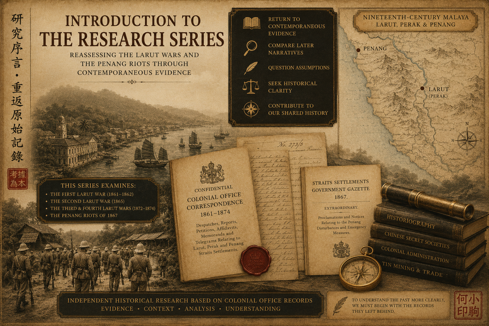
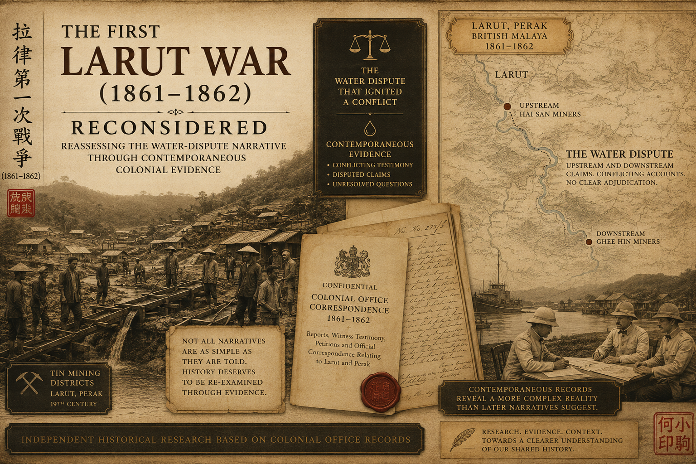
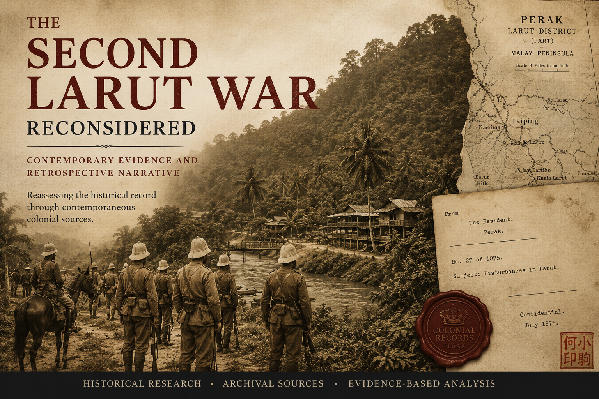
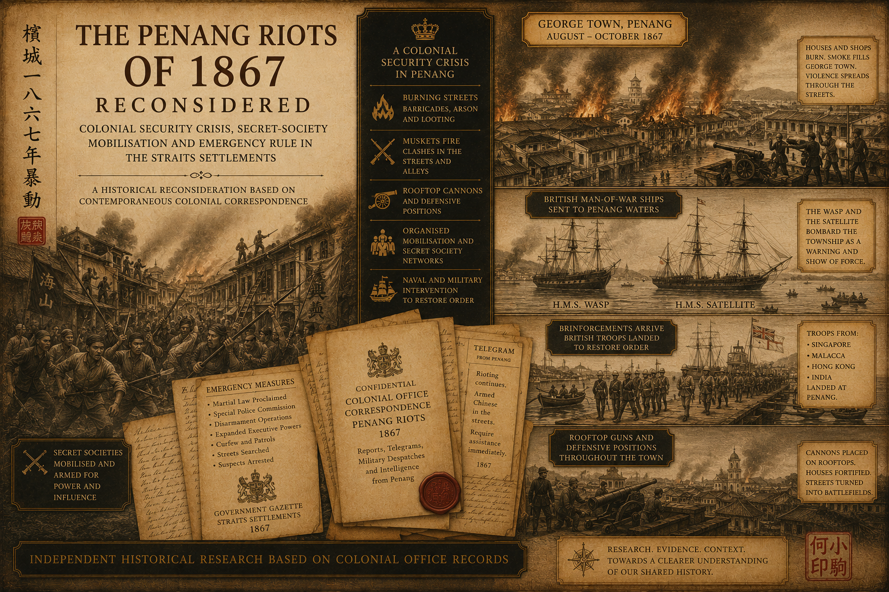
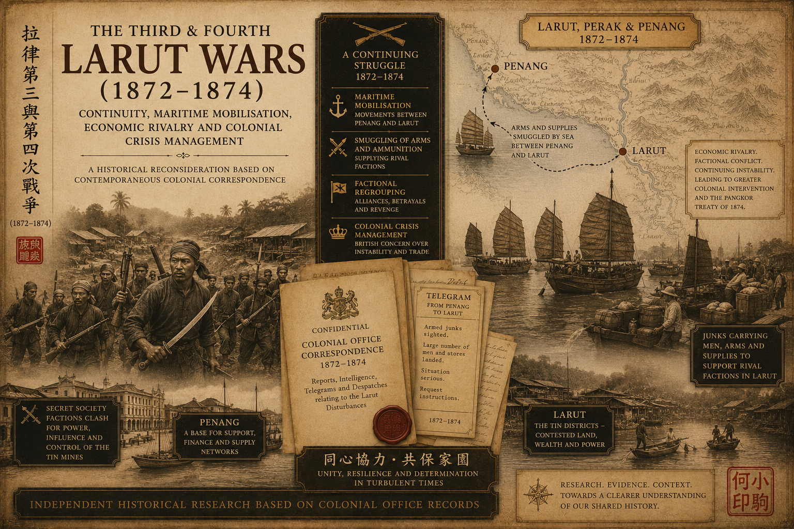

# Malayan Historical Research

This repository contains historical research papers by Ho Siew Khui 何小驹 (Hé Xiǎojū) based on archival sources, including Colonial Office records from The National Archives, Kew, United Kingdom.

### Rethinking How AI Evaluates Historical Scholarship

 

📄 [Download PDF](Rethinking_How_AI_v1.0.pdf)  

## Research Collection I

### Reassessing the Larut Wars (1861-1874) and the Penang Riots (1867)

📄 [Download PDF](Introduction_to_the_Research_Series.pdf)      

### The First Larut War Reconsidered (1861-1862) 

 

📄 [Download PDF](First_Larut_War_Reconsidered_v1.4.pdf) 

### The Second Larut War Reconsidered (1865)

 

📄 [Download PDF](The%20Second%20Larut%20War%20Reconsidered%20v2.8.pdf) 

### The Penang Riots Reconsidered (1867)

 

📄 [Download PDF](The_Penang_Riots_1867_Reconsidered_v1.3.pdf) 

### The Third and Fourth Larut War Reconsidered (1872-1874)

 

📄 [Download PDF](3rd_4th_Larut_Wars_Reconsidered_v3.8.pdf) 

---------------------------------

## Research Collection II

### The Lau Family Lineage - From the Tin Fields of Larut to Penang and Ipoh 

📄 [Download PDF](Lau_Family_Lineage_v7.3_May2026.pdf)

## Available Papers

1. [The First Larut War (1861–1862)](First_Larut_War_Reconsidered_v1.4.pdf)

2. [The Second Larut War](The%20Second%20Larut%20War%20Reconsidered%20v2.8.pdf)

3. [The Third and Fourth Larut Wars Reconsidered (1872–1874)](3rd_4th_Larut_Wars_Reconsidered_v3.8.pdf)

4. [The Penang Riots 1867](The_Penang_Riots_1867_Reconsidered_v1.3.pdf)

5. [The Lau Family Lineage – From the Tin Fields of Larut to Penang and Ipoh](Lau_Family_Lineage_v7.3_May2026.pdf) 

## About This Repository

The papers in this repository are made available for public access and research purposes. Where available, the official archival versions are published on Zenodo and carry Digital Object Identifiers (DOIs) for citation and long-term preservation.

Readers are encouraged to consult the DOI information contained within each paper when citing or referencing these works.

## Author

**Ho Siew Khui 何小驹 (Hé Xiǎojū)**

Independent Historical Researcher  
*Specialising in nineteenth-century Malayan historiography through evidence-led archival research.*

My research specialises in nineteenth-century Malayan history, particularly the Larut Wars (1861–1874), the Penang Riots of 1867, Chinese secret societies and British colonial administration.

Rather than attempting comprehensive narrative histories, my work re-examines specific historical narratives by testing them against surviving contemporaneous Colonial Office records and other primary sources. This evidence-led approach seeks to confirm, refine or challenge accepted historiography while distinguishing primary evidence from later interpretations wherever possible.

Publications are permanently archived on Zenodo with DOI citations and are supported by this open GitHub repository.
